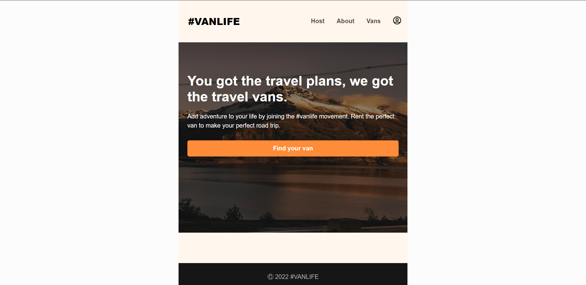
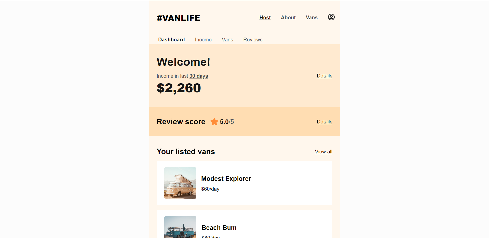
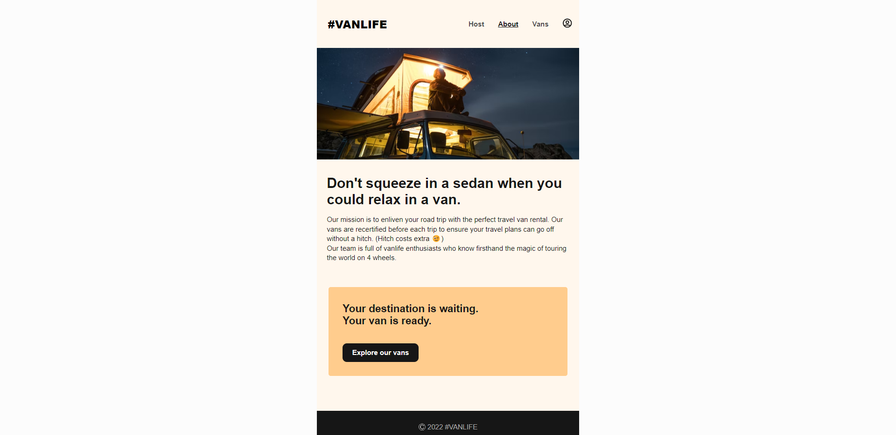
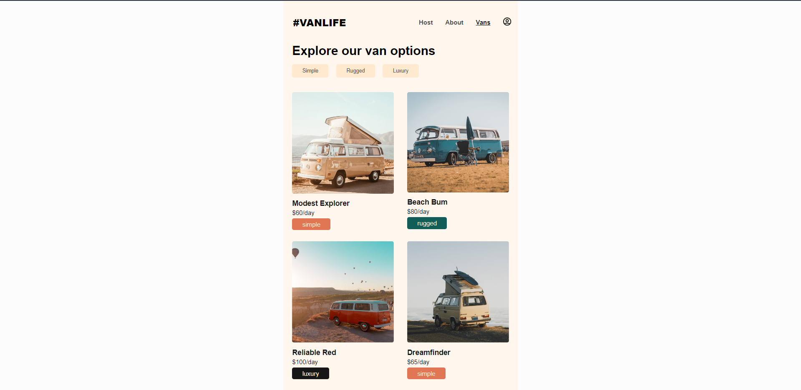
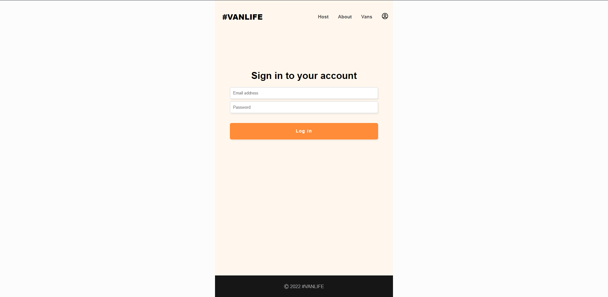

# VanLife

VanLife is a user-friendly website built with React that simplifies van searches. It is a web app used to browse different types of vans. It allows users to log in and offers convenient tag-based filtering for easy browsing.

## Screenshots

### Home page



### Host page



### About page



### Vans page



### Login page



## Technologies used

-   [React](https://react.dev/)

## Packages used

-   [React-dom](https://www.npmjs.com/package/react-dom)
-   [React-icons](https://www.npmjs.com/package/react-icons)
-   [Mirage.js](https://miragejs.com/)

## Database used

-   [Firebase - cloud firestore](https://firebase.google.com/docs/firestore)

## Features

-   User authentication and authorization powered by Firebase
-   Dynamic routing
-   Database interaction and ORM using Prisma
-   Responsive and modern UI design
-   Fully responsive on all devices

## Getting Started

To get started with VanLife, follow these steps:

1. Clone the repository:

```bash
  git clone https://github.com/Shivam-Sharma-1/Van-Life.git
```

2. Navigate to the project directory

```bash
  cd van-life
```

3. Install the dependencies:

```bash
  npm install
  # or
  yarn install
```

4. Start the development server:

```bash
  npm run dev
  # or
  yarn dev
```

The application should now be running on `http://localhost:5173`

## Usage

To log in to the app use the following credentials  
Email: user123@com  
Password: u123

## Website hosted URL

This website is deployed using using Netlify  
Website url: https://myvanlife.netlify.app

## Contributing

Contributions are always welcome!  
If you would like to contribute to this project, please fork the repository and create a pull request.

## Authors

-   [@Shivam-Sharma-1](https://github.com/Shivam-Sharma-1)

## Acknowledgements

-   [Learn React Router 6 by Scrimba](https://scrimba.com/learn/reactrouter6)

## Read more

This project was created using various open-source libraries and frameworks.

-   [HTML docs](https://developer.mozilla.org/en-US/docs/Web/HTML)
-   [CSS docs](https://developer.mozilla.org/en-US/docs/Web/CSS)
-   [JavaScript docs](https://developer.mozilla.org/en-US/docs/Web/JavaScript)
-   [Firebase docs](https://firebase.google.com/docs)
-   [React docs](https://react.dev/blog/2023/03/16/introducing-react-dev)
-   [Netlify docs](https://docs.netlify.com/)
